# WordPress Multilingual Website

## Overview
This project is a multilingual WordPress website built with the Hestia theme. You can either download the complete project or just the theme for your needs.

## Installation
1. Extract the project files to your local server (e.g., Laragon)
2. Run the project locally for testing

## Login Credentials
- **Username:** saifeddinebensalem
- **Password:** JOhDCGI&WxPilY2O^O

## Customization Options

### Theme Customization
You can customize the website's appearance through WordPress Customizer:
- Navigate to `Appearance => Customize`
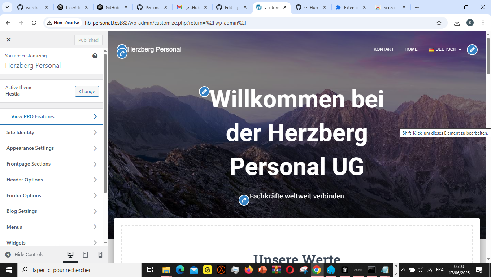

### Language Translation
Manage translations through the WordPress translation interface:
- Navigate to `Languages => Translations`
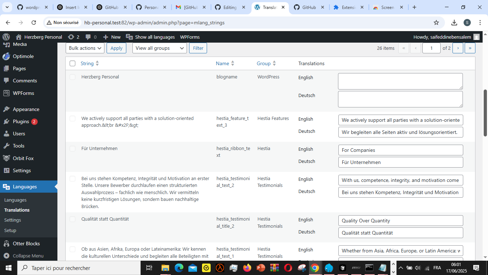

## Email Configuration
This project uses EmailJS for email functionality, which provides 200 emails per day.

### EmailJS Account
You can either:
1. Create a new account, or
2. Use the provided credentials:
   - **Email:** kandimkarphona@gmail.com
   - **Password:** Kandim123

### Email Template Configuration
Configure the reception email in the template:
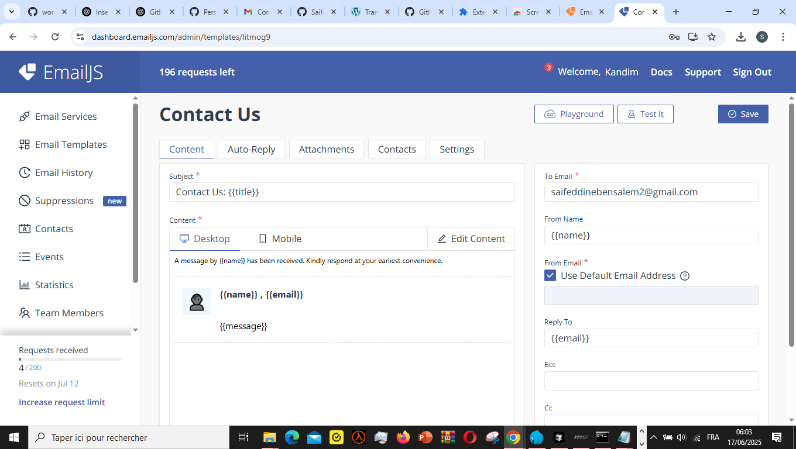

## Website Preview

### German Version Screenshots
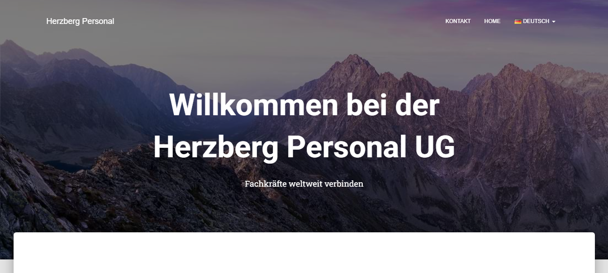
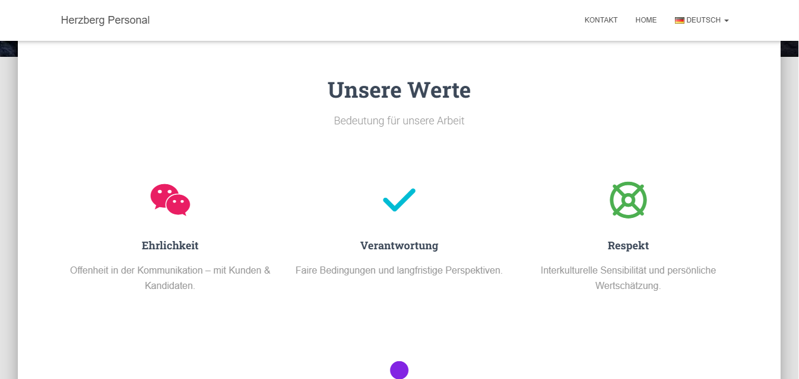
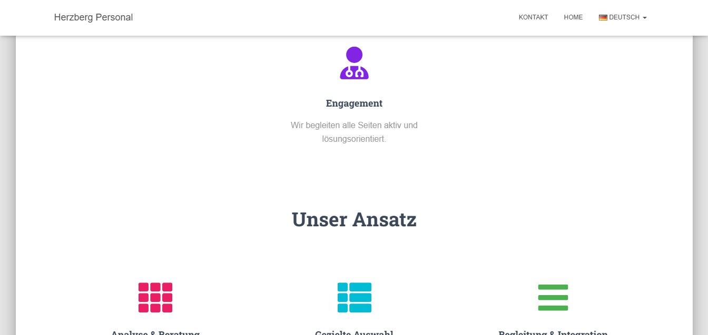
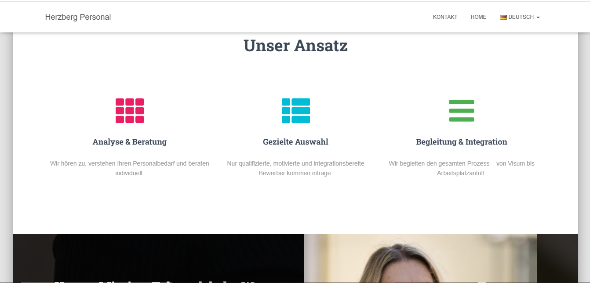
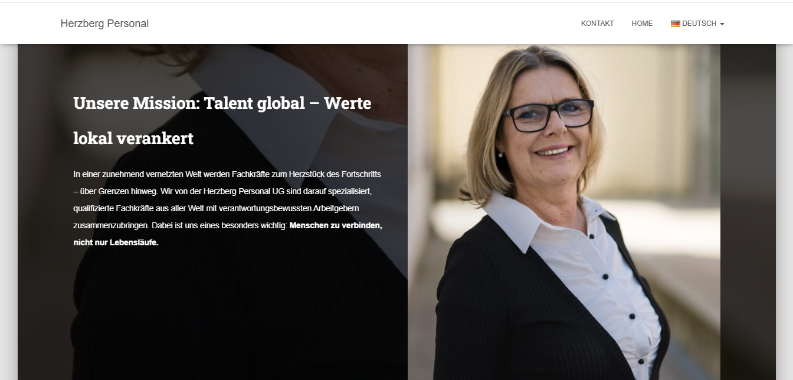
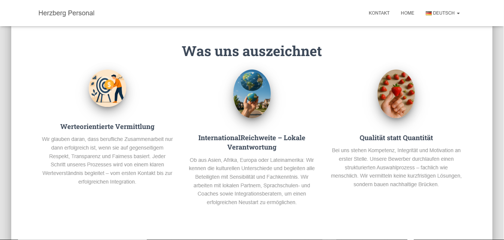
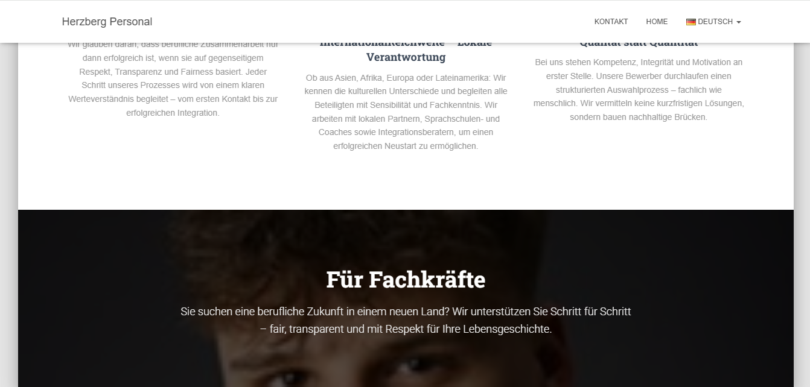
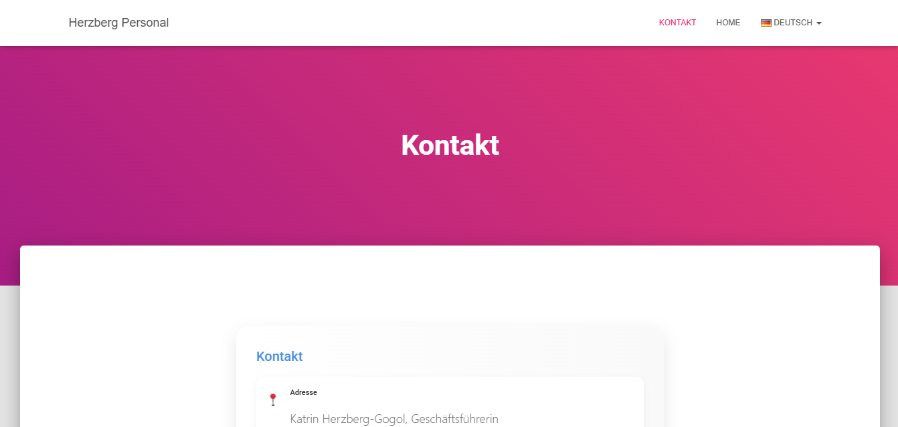
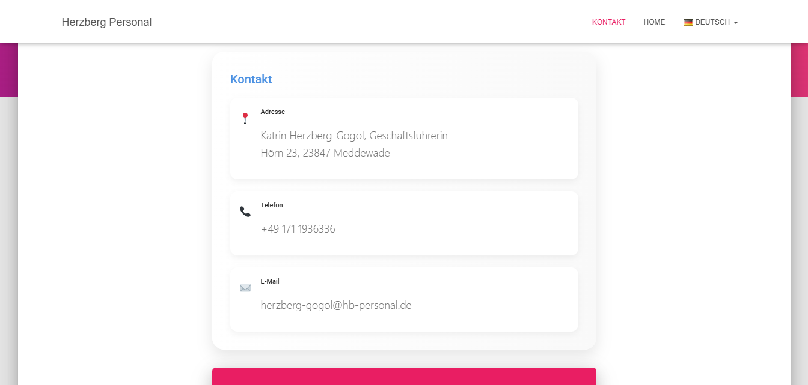
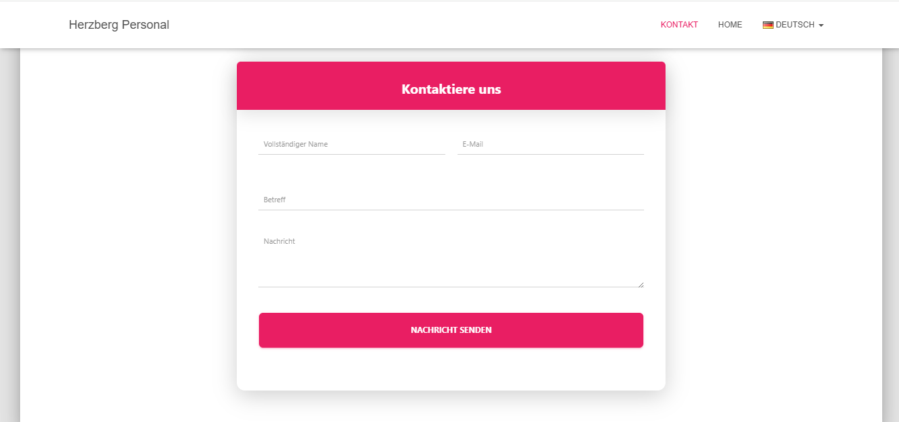

## Support
For any questions or support, please contact the development team.
