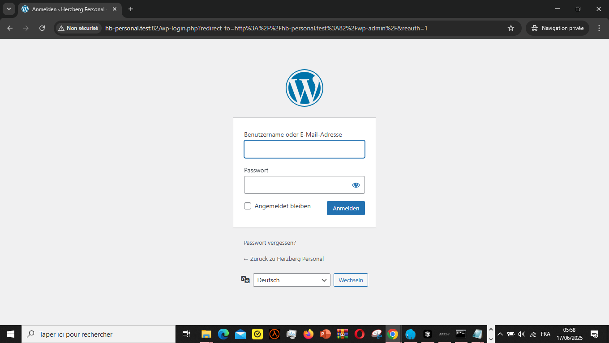
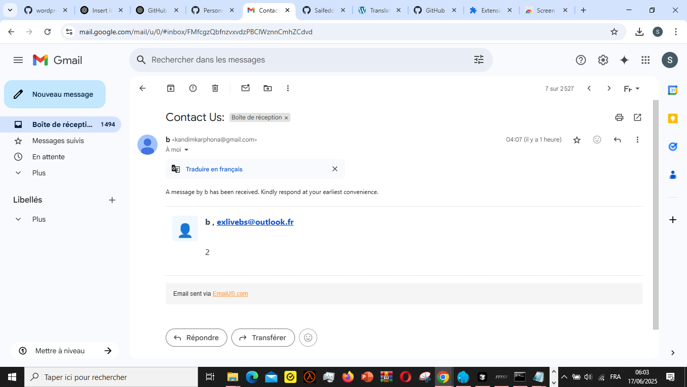

# wordpress_project
Feel free to either download the whole project, or only the theme which it's hestia.

Extract the installed data in laragon (as an exemple) and run for local test.

For login info: 
Username:saifeddinebensalem
password:JOhDCGI&WxPilY2O^O

Feel free to change the data either by browsing to Appearance => Customize  

or changing via the translator Languages => Translations : 

About the emailing :
EmailJs was used in this project, it delivers 200 emails per day. 

Feel free to create an account from 0 or login via those cordonitials to configurate the reception email :
email:kandimkarphona@gmail.com
password:Kandim123 

and change the reception email in the template : 

Result of work : 

Deutsch version

